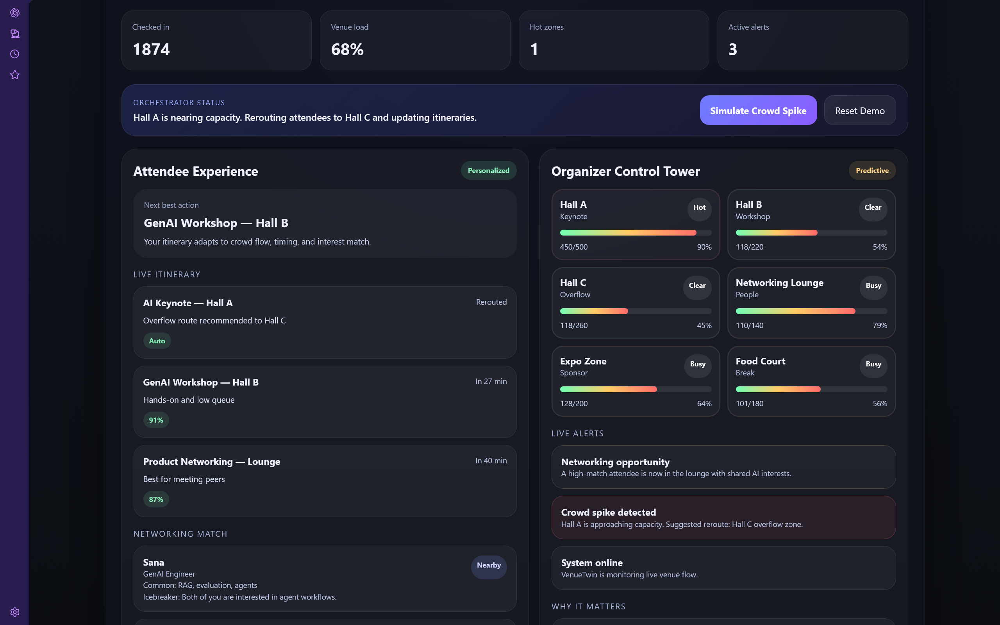
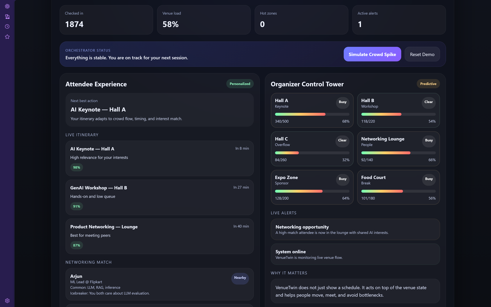
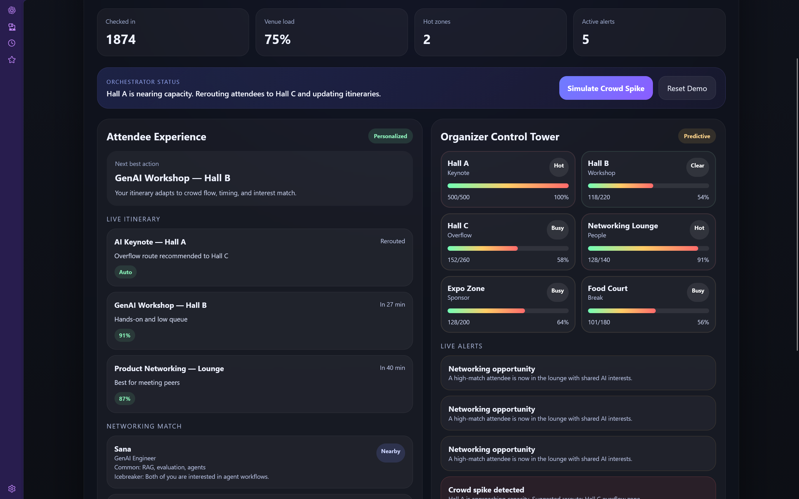

# VenueTwin Concierge

## 🚀 One-line Pitch

VenueTwin Concierge is a real-time AI digital twin for physical events that helps attendees navigate better and helps organizers predict crowd issues before they happen.

---

## 💡 Problem

Physical events are chaotic. Attendees miss sessions, queues get overcrowded, and organizers lack real-time visibility.

---

## 🧠 Solution

VenueTwin creates a live digital twin of the venue and simulates intelligent agents that dynamically guide attendees and manage crowd flow.

---

## ✨ Features

* Personalized attendee itinerary
* AI-powered networking suggestions
* Live venue heatmap
* Crowd spike detection
* Real-time alert system

---

## 📸 Screenshots

### Attendee Experience

### Before Crowd Spike

### After Crowd Spike Alert

---

## 🎬 Demo

(Add your demo video link here)

---

## 🛠️ Tech Stack

React (Vite), JavaScript

---

## 🎯 Why it matters

This transforms static event apps into real-time intelligent systems using a digital twin approach.
